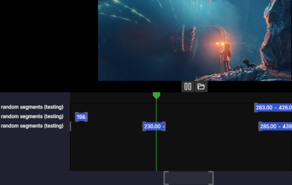

outseek - assist editing long videos by correlating its timeline with various sources of metadata

WIP - under active development, and not really useful for anything yet.

Automatic nightly builds are available for
- [windows x64](https://nightly.link/Felk/outseek/workflows/publish/main/outseek-win-x64.zip)
- [linux x64](https://nightly.link/Felk/outseek/workflows/publish/main/outseek-linux-x64.zip)

I don't own any OSX machine to test on, so I cannot provide builds for that.

You currently need to have VLC media player (64-bit) installed because it does not get bundled to achieve a smaller file size and faster startup time.
- Windows: VLC is expected to either be on the PATH or installed in the default location (`C:/Program Files/VideoLAN/VLC`)
- Linux: libvlc is expected to be available as a system library, e.g. by installing it through `sudo apt-get install vlc libvlc-dev`

You also need to have [Python 3](https://www.python.org/downloads/) installed on your system and available on the PATH to use any features that use Python libraries.
On Linux python is usually already available.
For Windows I am considering to just bundle it in the future.
